# BizFlow CRM

BizFlow CRM is a modern full-stack MERN business management system built for small businesses to manage customers, items/services, quotations, invoices, payments, company settings, and branded business PDFs from one clean dashboard.

The system includes secure authentication, email verification, password reset using email codes, admin/user roles, user profile management, company branding, and downloadable branded invoice and quotation PDFs.

---

## Live Demo

Frontend: https://bizflow-crm-frontend.vercel.app  
Backend API: https://bizflow-crm-backend.vercel.app

---

## Project Screenshots

### Home Page
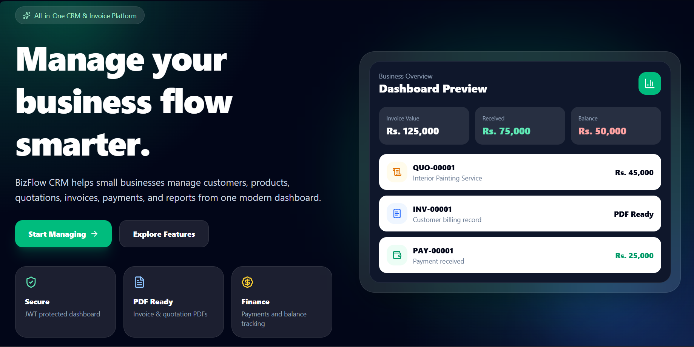

### Login Page
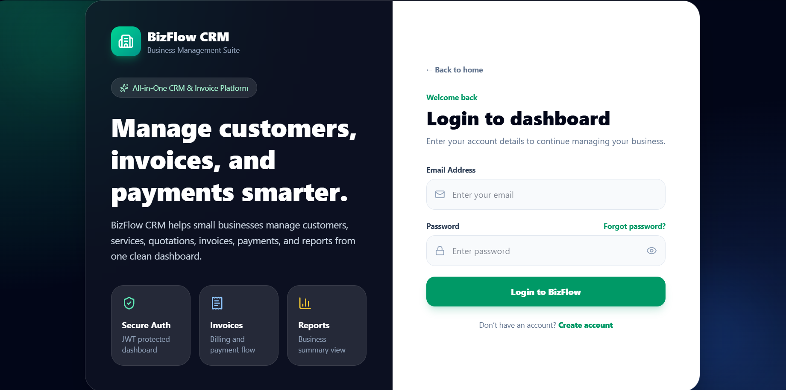

### Dashboard
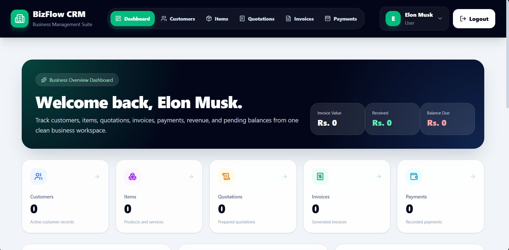

### Customer Management
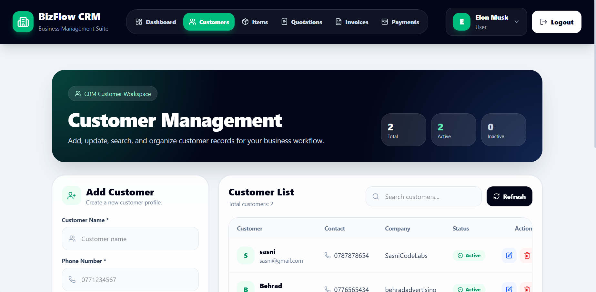

### Items Management
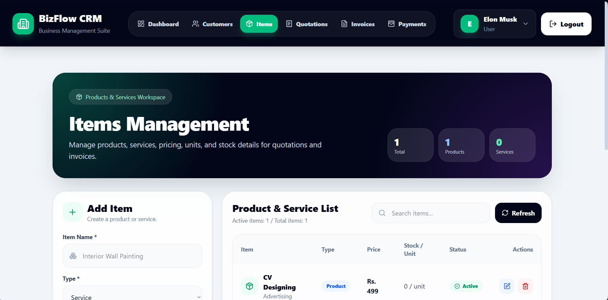

### Quotation Management
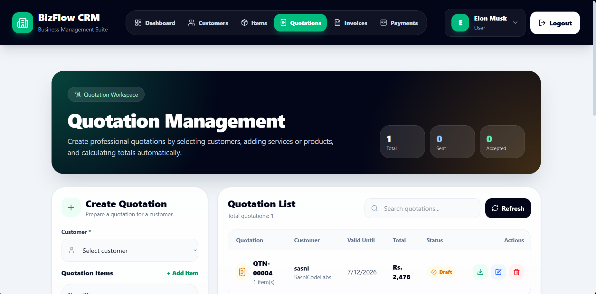

### Branded Quotation PDF
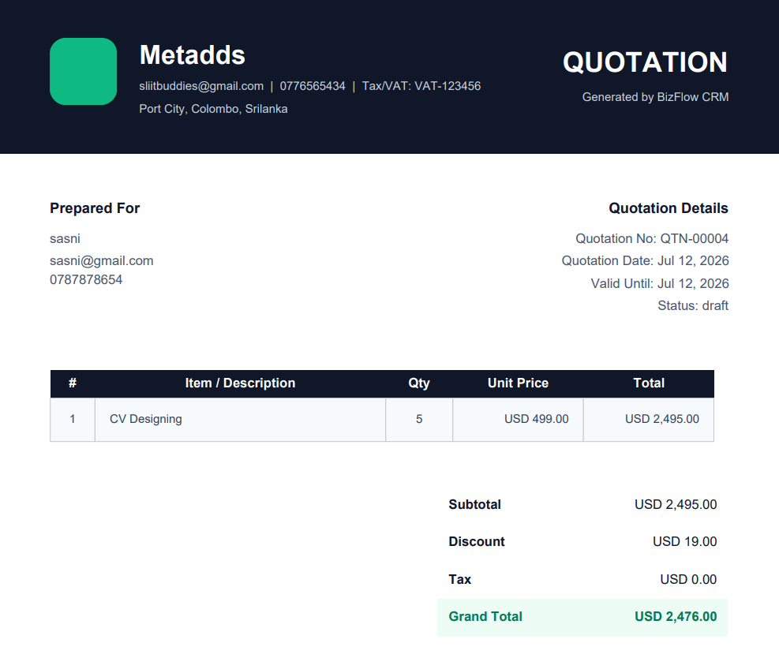

### Invoice Management
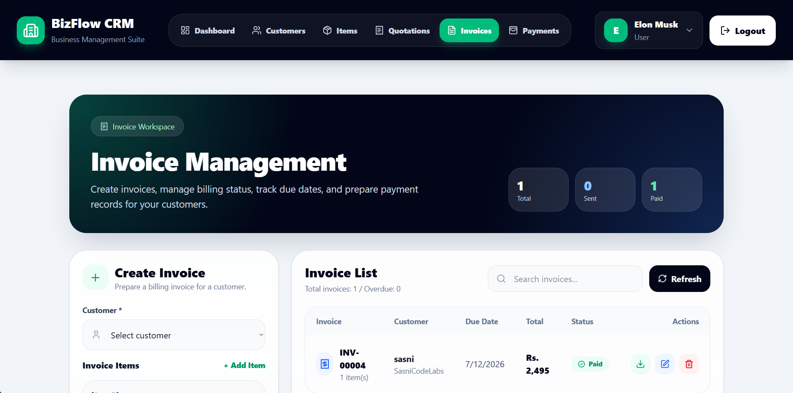

### Branded Invoice PDF
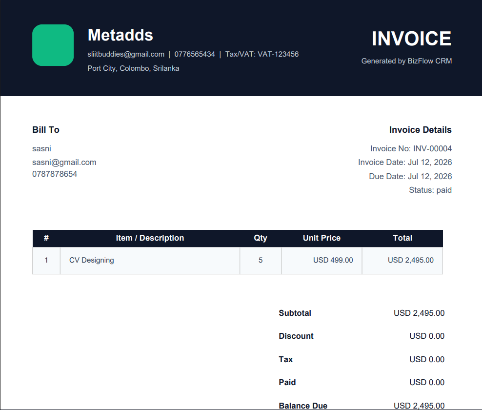

### Payment Management
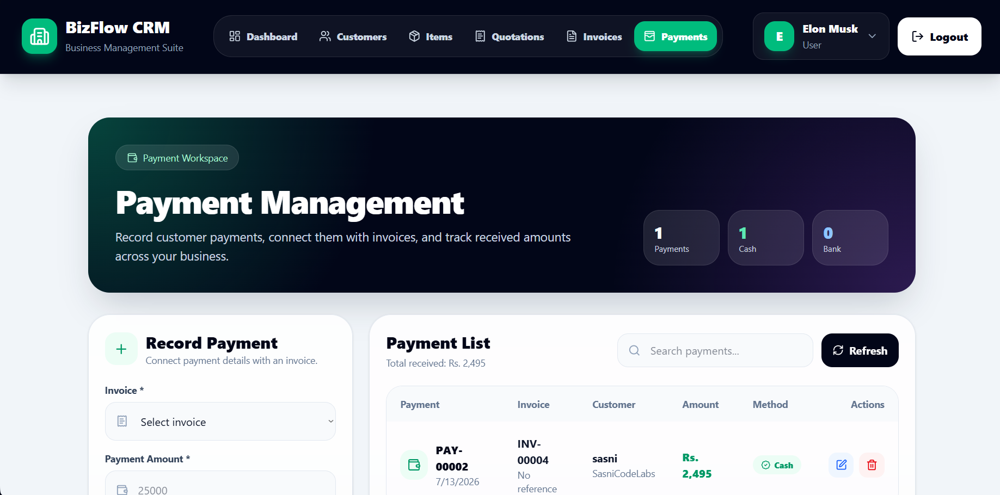

### My Profile
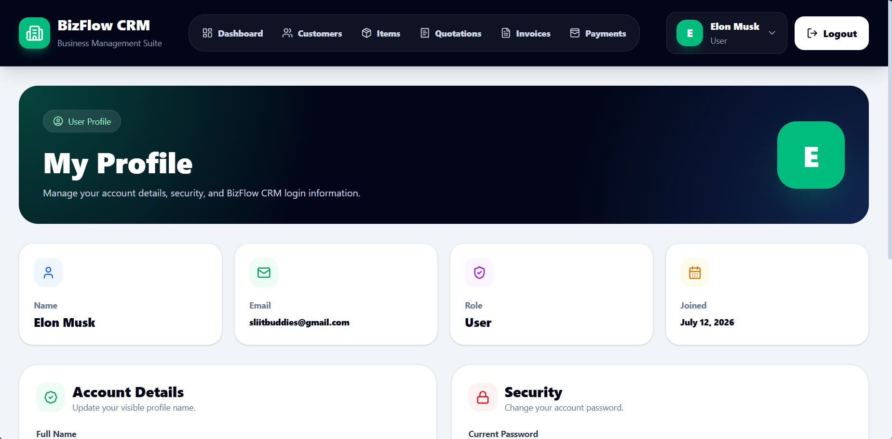

### Company Settings
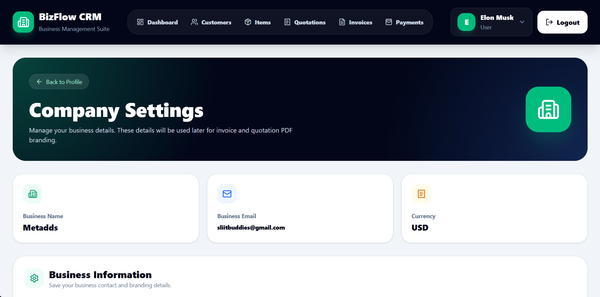

---

## Main Features

- Secure user registration and login
- Email verification using a 6-digit verification code
- Forgot password flow using email reset code
- JWT-based protected routes
- Admin/User role support
- User profile page
- Profile name update
- Change password functionality
- Company settings management
- Customer management
- Item/service management
- Quotation management
- Invoice management
- Payment tracking
- Dashboard business summary
- Branded quotation PDF generation
- Branded invoice PDF generation
- Responsive premium UI
- MongoDB Atlas cloud database
- Frontend and backend deployed separately on Vercel

---

## Company Branding Feature

BizFlow CRM allows users to save company/business details inside the Company Settings page.

Saved company details include:

- Business name
- Business email
- Phone number
- Business address
- Website
- Tax/VAT number
- Currency

These saved details are automatically displayed inside generated invoice and quotation PDFs. This makes the final PDF documents look professional and business-ready.

---

## Authentication Features

BizFlow CRM includes a complete email-based authentication flow.

### Registration Flow

1. User creates an account
2. Backend sends a 6-digit email verification code
3. User enters the verification code
4. Account becomes verified
5. User can access the dashboard

### Password Reset Flow

1. User enters registered email address
2. Backend sends a 6-digit password reset code
3. User enters reset code and new password
4. Password is updated securely
5. User can login using the new password

---

## Role Setup

Public registration creates normal user accounts by default.

```text
New registered users → user
Selected main account → admin
```

Admin role can be manually assigned from MongoDB Atlas by updating the user document:

```json
{
  "role": "admin"
}
```

This prevents public users from creating admin accounts from the frontend.

---

## Tech Stack

### Frontend

- React
- Vite
- Tailwind CSS
- React Router DOM
- Axios
- Lucide React
- jsPDF
- jsPDF AutoTable

### Backend

- Node.js
- Express.js
- MongoDB Atlas
- Mongoose
- JWT Authentication
- bcryptjs
- Nodemailer
- CORS
- dotenv

### Deployment

- Frontend: Vercel
- Backend: Vercel
- Database: MongoDB Atlas

---

## Folder Structure

```text
BizFlow-CRM/
│
├── backend/
│   ├── api/
│   ├── config/
│   ├── controllers/
│   ├── middleware/
│   ├── models/
│   ├── routes/
│   ├── utils/
│   ├── server.js
│   ├── package.json
│   └── vercel.json
│
├── frontend/
│   ├── src/
│   │   ├── api/
│   │   ├── components/
│   │   ├── pages/
│   │   ├── utils/
│   │   ├── App.jsx
│   │   └── main.jsx
│   ├── package.json
│   └── vercel.json
│
├── screenshots/
├── README.md
└── .gitignore
```

---

## Installation Guide

### 1. Clone the repository

```bash
git clone https://github.com/Insath67/bizflow-crm.git
cd bizflow-crm
```

---

## Backend Setup

Go to the backend folder:

```bash
cd backend
npm install
```

Create a `.env` file inside the `backend` folder:

```env
MONGO_URI=your_mongodb_atlas_connection_string
JWT_SECRET=your_jwt_secret
NODE_ENV=development

EMAIL_HOST=smtp.gmail.com
EMAIL_PORT=465
EMAIL_SECURE=true
EMAIL_USER=your_email@gmail.com
EMAIL_PASS=your_gmail_app_password
EMAIL_FROM=BizFlow CRM <your_email@gmail.com>
```

Run backend:

```bash
npm run dev
```

Backend runs on:

```text
http://localhost:5000
```

---

## Frontend Setup

Go to the frontend folder:

```bash
cd frontend
npm install
```

Create a `.env` file inside the `frontend` folder:

```env
VITE_API_URL=http://localhost:5000/api
```

Run frontend:

```bash
npm run dev
```

Frontend runs on:

```text
http://localhost:5173
```

---

## API Modules

The backend includes the following main API modules:

```text
/api/auth
/api/customers
/api/items
/api/quotations
/api/invoices
/api/payments
/api/dashboard
/api/company
```

---

## Important Backend Routes

### Auth Routes

```text
POST /api/auth/register
POST /api/auth/verify-email
POST /api/auth/resend-verification-code
POST /api/auth/login
POST /api/auth/forgot-password
POST /api/auth/reset-password
GET  /api/auth/profile
PUT  /api/auth/profile
PUT  /api/auth/change-password
```

### Company Routes

```text
GET /api/company
PUT /api/company
```

---

## Core Modules

### Dashboard

The dashboard shows a business summary including:

- Total customers
- Total items/services
- Total quotations
- Total invoices
- Total payments
- Invoice value
- Received amount
- Outstanding balance

### Customers

The customer module allows users to manage customer records with details such as name, email, phone, and address.

### Items

The items module allows users to manage products or services used inside quotations and invoices.

### Quotations

The quotation module allows users to create and manage quotations and download branded quotation PDFs.

### Invoices

The invoice module allows users to create and manage invoices and download branded invoice PDFs.

### Payments

The payment module allows users to record payments and track received amounts.

### Profile

The profile page allows users to view account details, update their profile name, and change their password.

### Company Settings

The company settings page allows users to save business details that are used for PDF branding.

---

## PDF Branding

Invoice and quotation PDFs automatically use saved company settings.

The PDF header includes:

- Company name
- Business email
- Phone number
- Website
- Tax/VAT number
- Address
- Currency

This makes generated documents suitable for real business use.

---

## Deployment Notes

### Backend Environment Variables on Vercel

```env
MONGO_URI=your_mongodb_atlas_connection_string
JWT_SECRET=your_jwt_secret
NODE_ENV=production

EMAIL_HOST=smtp.gmail.com
EMAIL_PORT=465
EMAIL_SECURE=true
EMAIL_USER=your_email@gmail.com
EMAIL_PASS=your_gmail_app_password
EMAIL_FROM=BizFlow CRM <your_email@gmail.com>
```

### Frontend Environment Variable on Vercel

```env
VITE_API_URL=https://bizflow-crm-backend.vercel.app/api
```

---

## Security Notes

- Passwords are hashed using bcryptjs
- JWT tokens are used for protected routes
- Email verification is required before login
- Password reset is handled using email reset codes
- Public users cannot register themselves as admin
- Admin role should be assigned manually through MongoDB Atlas

---

## Future Improvements

- Role-based permissions for admin and user actions
- Company logo upload for branded PDFs
- Email invoice/quotation directly to customers
- Payment receipt PDF generation
- Advanced reports and charts
- Export dashboard reports
- Activity logs
- Dark mode support

---

## Author

Developed by Muhammadh Insath.

This project was built as a professional full-stack MERN CRM portfolio project for business management, customer tracking, invoicing, quotation handling, payment tracking, email authentication, and branded PDF generation.