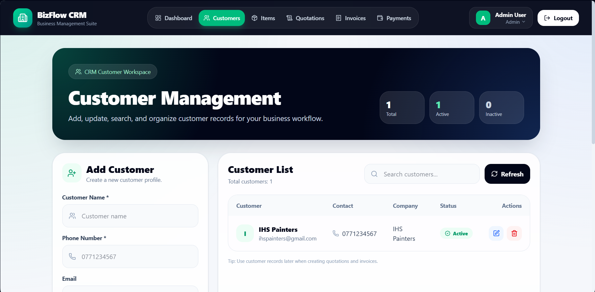
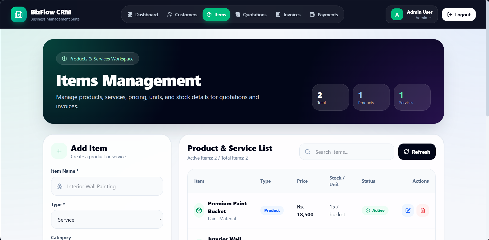
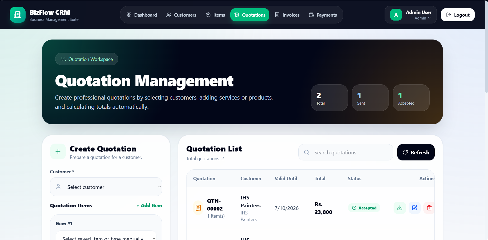
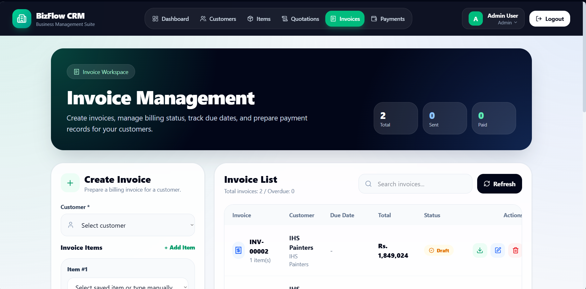
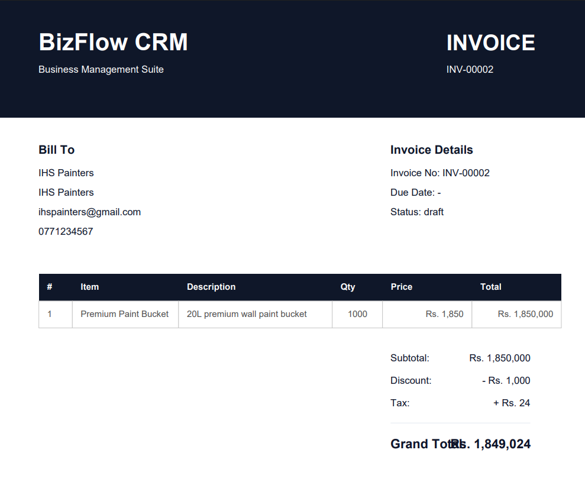
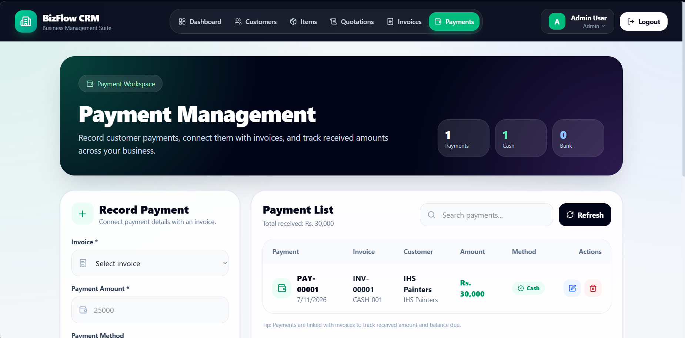

# BizFlow CRM

BizFlow CRM is a full-stack MERN business management system designed for small businesses to manage customers, products/services, quotations, invoices, payments, and business summaries from one clean dashboard.

The system includes a premium responsive user interface, JWT-based authentication, CRUD modules, financial tracking, and PDF generation for quotations and invoices.

---

## Screenshots

### 1. Home Page


### 2. Login Page


### 3. Dashboard


### 4. Customer Management


### 5. Items Management


### 6. Quotation Management


### 7. Quotation PDF


### 8. Invoice Management


### 9. Invoice PDF


### 10. Payment Management


---

## Features

### Authentication
- User login
- User registration
- Confirm password validation
- Forgot password page UI
- JWT protected dashboard routes
- Clean public landing page before login

### Dashboard
- Business overview dashboard
- Total customers, items, quotations, invoices, and payments
- Total invoice value
- Payments received
- Outstanding balance
- Recent quotations
- Recent invoices
- Recent payments
- Quick action cards

### Customer Management
- Add customers
- Edit customer details
- Delete customers
- Search customers
- Customer status management

### Items Management
- Add products or services
- Edit item details
- Delete items
- Search items
- Product/service type badges
- Price, stock, unit, category, and status support

### Quotation Management
- Create quotations
- Select customer
- Add multiple quotation items
- Auto calculate subtotal, discount, tax, and grand total
- Set valid until date
- Manage quotation status
- Edit and delete quotations
- Download quotation as PDF

### Invoice Management
- Create invoices
- Select customer
- Add multiple invoice items
- Auto calculate subtotal, discount, tax, and grand total
- Set due date
- Manage invoice status
- Edit and delete invoices
- Download invoice as PDF

### Payment Management
- Record customer payments
- Link payments with invoices
- Select payment method
- Add payment date and reference number
- Edit and delete payments
- Track received amount

---

## Tech Stack

### Frontend
- React.js
- Vite
- Tailwind CSS
- React Router DOM
- Axios
- Lucide React Icons
- jsPDF
- jsPDF AutoTable

### Backend
- Node.js
- Express.js
- MongoDB
- Mongoose
- JWT Authentication
- bcryptjs
- dotenv
- CORS

---

## Project Structure

```txt
BizFlow-CRM/
│
├── backend/
│   ├── config/
│   ├── controllers/
│   ├── middleware/
│   ├── models/
│   ├── routes/
│   ├── server.js
│   └── package.json
│
├── frontend/
│   ├── src/
│   │   ├── api/
│   │   ├── components/
│   │   ├── pages/
│   │   ├── utils/
│   │   ├── App.jsx
│   │   ├── main.jsx
│   │   └── index.css
│   └── package.json
│
├── screenshots/
│   ├── 01-home-page.png
│   ├── 02-login-page.png
│   ├── 03-dashboard.png
│   ├── 04-customers-page.png
│   ├── 05-items-page.png
│   ├── 06-quotations-page.png
│   ├── 07-quotation-pdf.png
│   ├── 08-invoices-page.png
│   ├── 09-invoice-pdf.png
│   └── 10-payments-page.png
│
├── .gitignore
└── README.md


## Live Demo

Frontend: https://bizflow-crm-frontend.vercel.app  
Backend API: https://bizflow-crm-backend.vercel.app